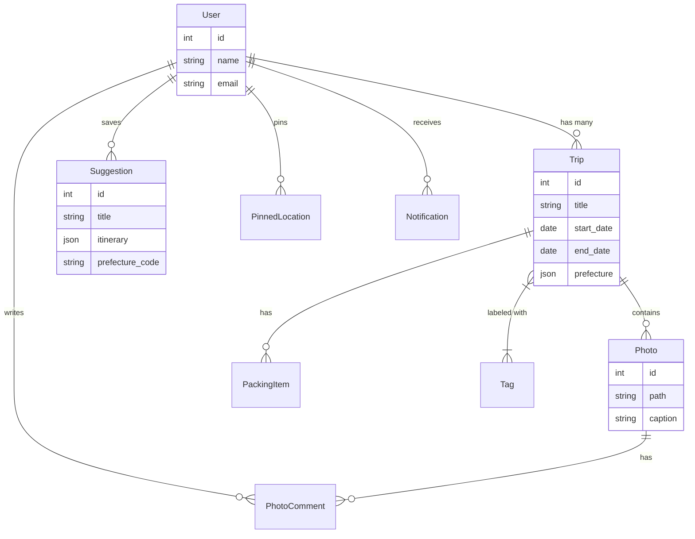
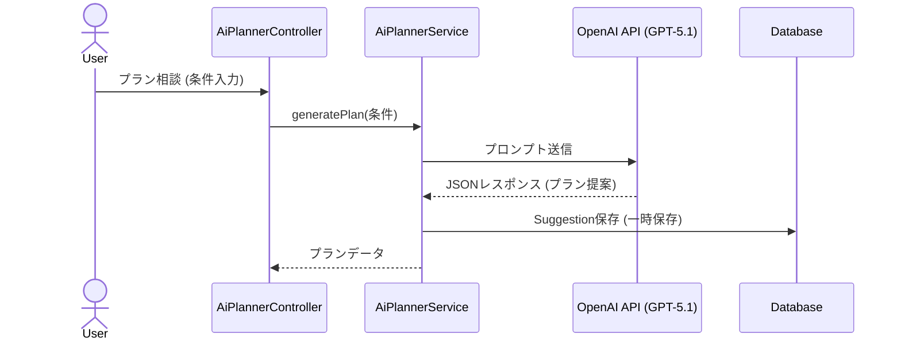
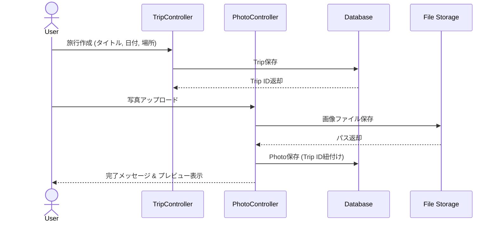
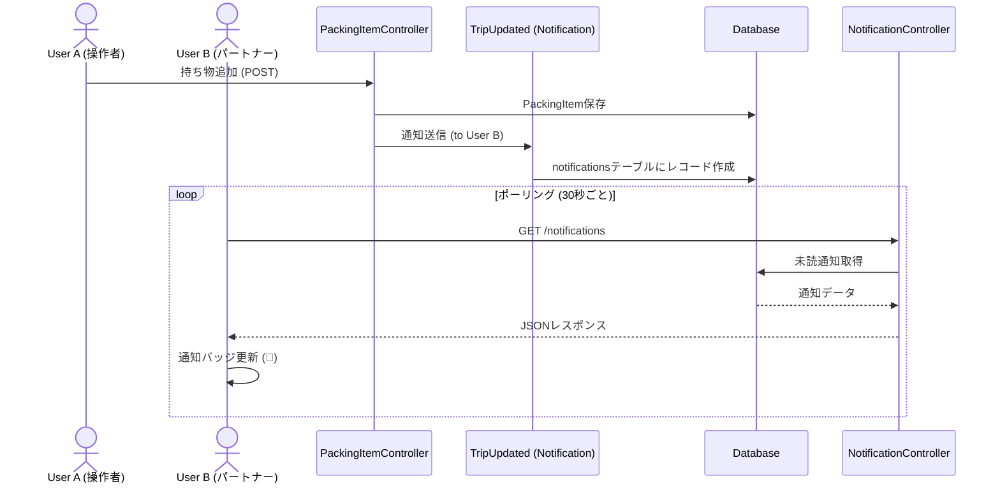
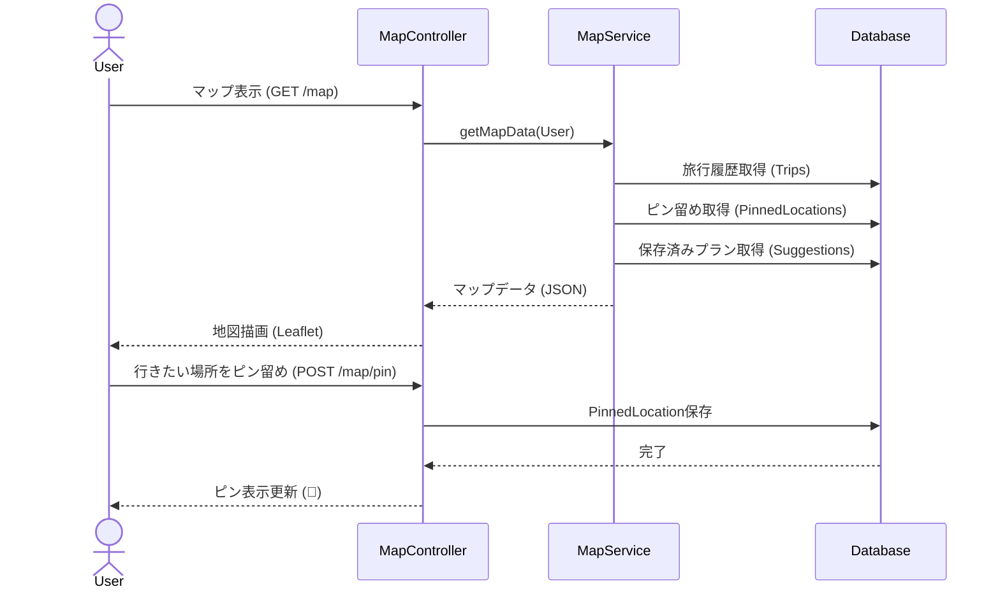

# 夫婦思い出アルバム (Omoide Album) 📸

夫婦の旅行の思い出を記録し、共有し、次の旅を計画するための Web アプリケーションです。
写真の保存、地図での制覇記録、AI によるプラン提案、持ち物リストの管理など、旅の「前・中・後」すべてをサポートします。

## 🚀 主な機能

### 1. 旅行記録 (Memories)

-   旅行のタイトル、日程、場所、詳細を記録
-   写真のアップロードとギャラリー表示
-   タグ付けによる整理（「温泉」「グルメ」など）
-   **あの日の思い出**: 1 年前の今日の旅行を自動でリマインド

### 2. 制覇マップ (Conquest Map)

-   **日本地図**: 訪問済みの都道府県を塗りつぶし
-   **世界地図**: 訪問済みの国を塗りつぶし
-   **写真マップ**: 地図上に訪問地で撮影した写真を表示
-   **ピン留め**: 行きたい場所をピン留めし、夫婦で共有（「行きたい！」「私も！」）

### 3. AI 旅行プランナー (AI Planner)

-   **チャット相談**: AI に行き先やプランを相談
-   **プラン提案**: 構造化された旅行プラン（スポット、時間、予算）を提案
-   **保存機能**: 気に入ったプランを保存して後で見返すことが可能

### 4. 旅のしおり (Packing List)

-   **持ち物チェックリスト**: 旅行ごとの持ち物管理
-   **テンプレート**: 「基本セット」「温泉セット」「海外旅行セット」などから一括追加
-   **リアルタイム共有**: 相手がチェックを入れると即座に反映

### 5. アクティビティログ (Notifications)

-   **アプリ内通知**: パートナーが写真をアップロードしたり、持ち物を追加した際に通知
-   **リアルタイム性**: 画面を開いていれば自動で通知バッジが更新されます

## 🛠 技術スタック

### Backend

-   **Framework**: Laravel 11
-   **Database**: MySQL 8.0+
-   **Auth**: Laravel Breeze (Session based)
-   **AI**: OpenAI API (chat-gpt-5.1)

### Frontend

-   **Framework**: Vue.js 3 (Composition API)
-   **Routing**: Inertia.js (Monolith structure)
-   **Styling**: Tailwind CSS
-   **Map**: Leaflet.js (via `vue-leaflet`)
-   **Icons**: Bootstrap Icons

## 💻 開発環境のセットアップ

### 前提条件

-   PHP 8.2+
-   Composer
-   Node.js 18+
-   MySQL 8.0+

### インストール手順

1. **リポジトリのクローン**

    ```bash
    git clone <repository-url>
    cd omoide-album
    ```

2. **依存関係のインストール**

    ```bash
    composer install
    npm install
    ```

3. **環境変数の設定**

    ```bash
    cp .env.example .env
    php artisan key:generate
    ```

    `.env` ファイルを開き、データベース接続情報と Google Gemini API キーを設定してください。

    ```env
    DB_CONNECTION=mysql
    DB_HOST=127.0.0.1
    DB_PORT=3306
    DB_DATABASE=omoide_album
    DB_USERNAME=root
    DB_PASSWORD=

    GEMINI_API_KEY=your-api-key-here
    ```

4. **データベースのマイグレーション**

    ```bash
    php artisan migrate
    ```

5. **開発サーバーの起動**

    ```bash
    # ターミナル1
    php artisan serve

    # ターミナル2
    npm run dev
    ```

## ☁️ Cloud Run デプロイガイド

本番環境（Google Cloud Run）へデプロイする際の重要事項です。
Cloud Run はステートレス（サーバーの状態を保持しない）な環境であるため、以下の設定が必須となります。

### ⚠️ 必須環境変数

以下の環境変数を Cloud Run のデプロイ設定に必ず含めてください。

| 変数名           | 設定値                               | 理由                                                                                 |
| :--------------- | :----------------------------------- | :----------------------------------------------------------------------------------- |
| `SESSION_DRIVER` | `database`                           | **必須**。ファイル保存だとデプロイやスケーリングのたびにログアウトされてしまいます。 |
| `CACHE_DRIVER`   | `database`                           | **推奨**。キャッシュをインスタンス間で共有し、通知機能などを安定させます。           |
| `APP_TIMEZONE`   | `Asia/Tokyo`                         | 通知の「◯ 分前」や日付表示を日本時間に合わせるため。                                 |
| `DB_SOCKET`      | `/cloudsql/INSTANCE_CONNECTION_NAME` | Cloud SQL への接続用（Unix Socket 使用時）。                                         |

### デプロイコマンド例

```bash
gcloud run deploy omoide-album \
  --image gcr.io/PROJECT_ID/IMAGE_NAME \
  --platform managed \
  --region asia-northeast1 \
  --allow-unauthenticated \
  --set-env-vars="APP_ENV=production,APP_DEBUG=false,APP_KEY=...,DB_CONNECTION=mysql,DB_SOCKET=...,DB_DATABASE=...,DB_USERNAME=...,DB_PASSWORD=...,SESSION_DRIVER=database,CACHE_DRIVER=database,APP_TIMEZONE=Asia/Tokyo"
```

### マイグレーション

Cloud Run へのデプロイ時、または Cloud Build のステップ内でマイグレーションを実行してください。
※ `sessions` テーブルと `cache` テーブルは、初期マイグレーションに含まれているため、`php artisan migrate` を実行すれば自動的に作成されます。

```bash
php artisan migrate --force
```

## 📝 開発者向けメモ

-   **通知機能**: `database` ドライバーを使用しています。ポーリング間隔は `NotificationBell.vue` で 30 秒に設定されています。
-   **地図機能**: 国土地理院タイル（日本）と OpenStreetMap（世界）を切り替えて使用しています。
-   **AI**: chat-gpt-5.1 モデルを使用しています。プロンプトは `SuggestionController` 内で定義されています。

## 📂 ディレクトリ構成

主要なディレクトリとファイルの構成です。

```
omoide-album/
├── app/
│   ├── Http/
│   │   ├── Controllers/    # リクエスト処理 (TripController, MapController etc.)
│   │   └── Middleware/     # HandleInertiaRequests (共有データ)
│   ├── Models/             # Eloquentモデル (Trip, Photo, User etc.)
│   ├── Services/           # ビジネスロジック (AiPlannerService, StatsService)
│   └── Notifications/      # 通知クラス (TripUpdated)
├── config/
│   └── packing.php         # 持ち物リストのテンプレート定義
├── database/
│   └── migrations/         # データベース定義
├── resources/
│   ├── css/                # Tailwind CSS設定
│   └── js/
│       ├── Components/     # 再利用可能なVueコンポーネント (NotificationBell etc.)
│       ├── Layouts/        # ページレイアウト (AppLayout)
│       └── Pages/          # 各ページビュー (Trips/Show, Map/Index etc.)
└── routes/
    └── web.php             # ルーティング定義
```

## 📊 ER 図 (Entity Relationship)

アプリケーションのデータ構造です。



## 🔄 シーケンス図 (AI 旅行プラン作成)

ユーザーが AI に旅行プランを相談し、提案を受け取るまでのフローです。



    Controller-->>User: プラン表示 (Inertia)

    User->>Controller: プラン保存 (Save)
    Controller->>DB: Suggestion更新 (is_saved = true)
    DB-->>Controller: 完了
    Controller-->>User: 保存完了通知

## 🔄 シーケンス図 (旅行記録 & 写真アップロード)

旅行の思い出を記録する際のフローです。



## 🔄 シーケンス図 (持ち物追加 & 通知)

持ち物を追加した際に、パートナーに通知が届くまでのフローです。



## 🔄 シーケンス図 (マップ制覇 & ピン留め)

地図上で「行った場所」や「行きたい場所」を管理するフローです。



```

```
